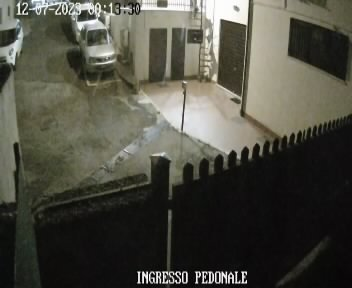

# image-sec
Object detection processing pipeline for confirming overnight surveillance service, using OpenCV and Yolov8

## Example

A camera would take pics, the goal is to confirm a certain car does in fact pass by...

| Frame | Image | Comment |
|-------|--------|----------|
| 1 |  | _Snap pic if movement_ |
| 2 |  | _Parked cars don't help_ |
| 3 |  | _Occlude other cars with cv2_ |
| 4 |  | _Detections now relevant_ |

> The source code would process the images and send informative emails accordingly
